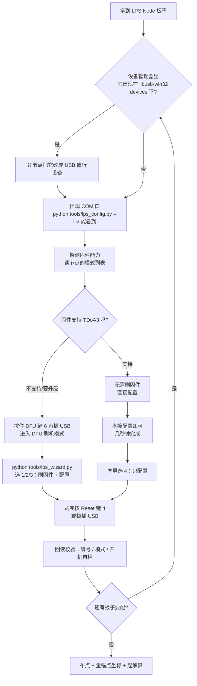
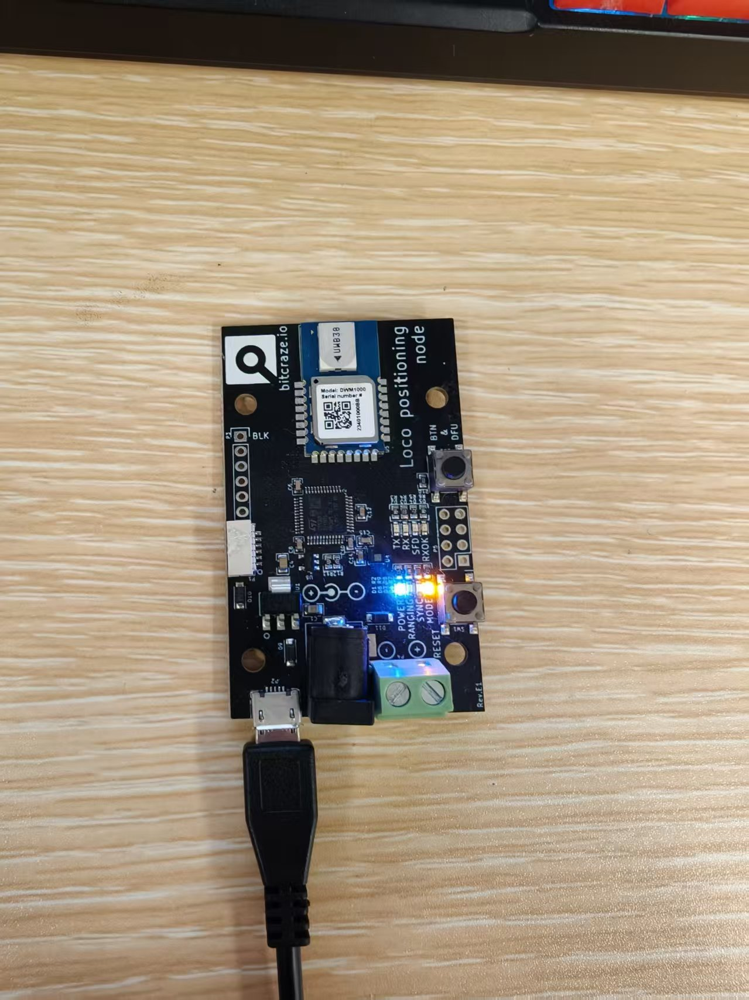
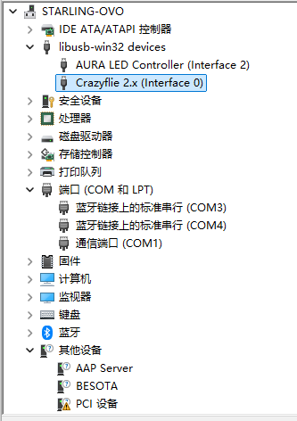
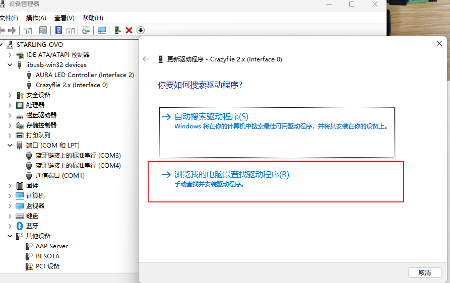
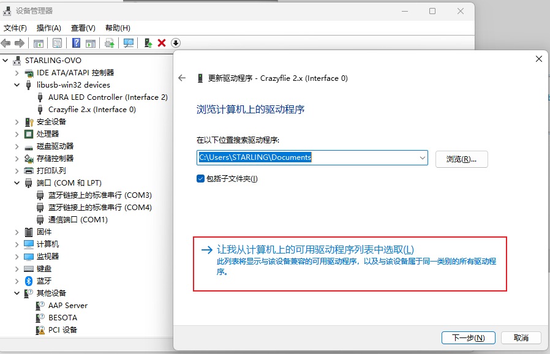
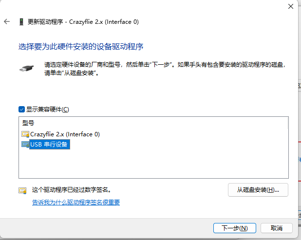
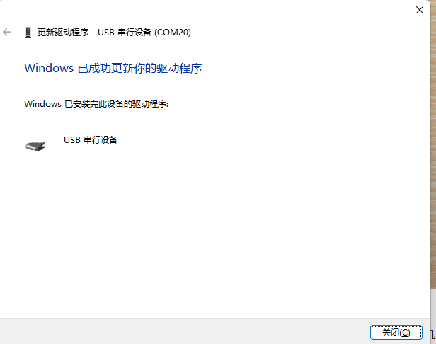
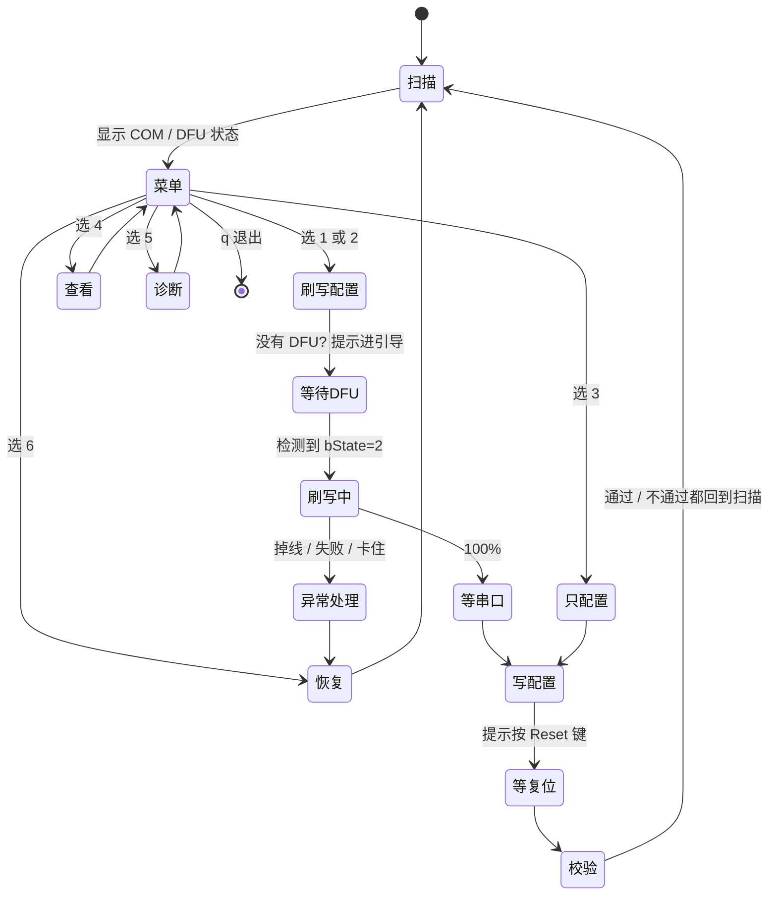

# LPS Node 完整操作流程（硬件 → 驱动 → 刷写 → 配置）

> 本文回答一件事：**拿到一块 LPS Node，从插上到能用，每一步到底做什么。**
> 顺序很重要：**先解决驱动（否则读不到），再决定刷固件还是改配置。**

---

## 总览流程图



同一张流程图（纯文本版，方便贴到别处）：

```
  ┌──────────────┐
  │ 拿到节点板子  │
  └──────┬───────┘
         ▼
  ┌──────────────────────────────┐   是   ┌────────────────────────────┐
  │ 设备管理器里它在 libusb 下吗？ ├───────►│ 逐节点改成「USB 串行设备」   │
  └──────┬───────────────────────┘        │ （每块板子各做一次）         │
         │ 否                              └────────────┬───────────────┘
         └─────────────────────────────────────────────┘
         ▼
  ┌──────────────────┐
  │ 能看到 COM 口     │  ← python tools/lps_config.py --list
  └────────┬─────────┘
           ▼
     ┌─────┴─────┐
     │ 要做什么？ │
     └──┬─────┬──┘
        │     │
   刷固件│     │只改配置
        ▼     ▼
  ┌───────────┐ ┌──────────────┐
  │按住 DFU 键 │ │ 直接运行模式  │
  │再插 USB    │ │ 配置即可      │
  └─────┬─────┘ └──────┬───────┘
        ▼              │
  ┌─────────────────┐  │
  │ 向导 1/2：刷+配  │  │
  └────────┬────────┘  │
           └─────┬─────┘
                 ▼
        ┌─────────────────┐
        │ 按 Reset 键 4    │
        │ 或拔插 USB       │
        └────────┬────────┘
                 ▼
        ┌─────────────────┐
        │ 回读校验通过     │──► 还有板子？ ──是──► 回到最上面
        └─────────────────┘         │
                                    否
                                     ▼
                          布点 + 量坐标 + 解算
```

---

## 0. 先认识硬件（插线之前先看这一节）



板子丝印上写得很清楚，按图对照：

| 位置 | 丝印 | 说明 |
|---|---|---|
| 右侧靠上按钮 | **BM & DFU** | **按住它再插 USB = 进入刷机（DFU）模式** |
| 右侧靠下按钮 | **RESET** | 复位。**配置改完后按它生效**，比拔插 USB 快 |
| 左下 | micro-USB | 供电 + 通信（刷机和配置都走这里） |
| 下中 | 电源座 | 可外接 5V，USB 只走数据（刷写更稳，推荐） |
| 右下 | 绿色端子 | 5–12V 供电 |
| 板中央 | DWM1000 | UWB 射频模块（IEEE 802.15.4） |
| 下方一排 LED | POWER / RANGING / SYNC / MODE / TX / RX / SFD / RXOK | 状态指示，见下表 |

**不看电脑也能判断板子状态**：

| LED | 含义 |
|---|---|
| POWER（蓝） | 已通电 |
| MODE（黄） | **常亮 = 基站(Anchor)，闪烁 = Sniffer(数据出口)，熄灭 = Tag** |
| RANGING（红） | 闪烁 = 正在测距 |
| TX（红）/ RX（绿） | UWB 正在发送 / 接收 |
| SFD（黄）/ RXOK（红） | 检测到前导码 / 收到无错包 |

---

## 1. 第一步：先解决驱动问题（**必须最先做**）

### 为什么会读不到节点

LPS Node 有两种模式：

- **常态工作模式** —— 会枚举成一个 USB 串口，能读能配
- **DFU 模式** —— 只用于刷固件，**这个模式下不会出现 COM 口**

而在 Windows 上还有一个坑：**LPS Node 与 Crazyflie / Crazyradio 的 USB VID:PID 完全相同（`0483:5740`）**。
如果你之前用过 Crazyflie 的 PA radio、按官方教程用 Zadig 装过 libusb 驱动，
那么节点插上后会被自动归到 **libusb-win32 devices** 下 —— 这时它是"常态工作模式"，
但 Windows 不会给它创建 COM 口，所以你既读不到、也刷不了。

### 怎么确认中招了

打开**设备管理器**，看两处：

1. `libusb-win32 devices` 下有没有 **`Crazyflie 2.x (Interface 0)`**
2. `端口 (COM 和 LPT)` 下有没有 `USB 串行设备 (COMx)`



也可以一条命令判断（会自动告诉你是不是驱动被占用）：

```powershell
python tools\lps_config.py --list
```

### 解决办法：**逐节点**把 libusb 改回串口（推荐）

> **每块 LPS Node 都要各做一次。**
> 不建议"直接卸载整个 Crazyflie radio 的驱动"——那会连带影响 Crazyradio，
> 以后要用就得重新装回来。

**操作前：只插要改的那一块节点**，其他节点和 Crazyradio 都拔掉。

1. 右键 `Crazyflie 2.x (Interface 0)` → **更新驱动程序**

   

2. 选 **浏览我的电脑以查找驱动程序** → 再选 **让我从计算机上的可用驱动程序列表中选取**

   

3. 在列表里选 **USB 串行设备** → 下一步

   

4. 完成后会提示"Windows 已成功更新你的驱动程序"，并且名字变成 **USB 串行设备 (COMx)**

   

5. 拔插一次 USB，确认：

   ```powershell
   python tools\lps_config.py --list      # 应列出 COMx
   ```

6. 换下一块节点，重复 1)~5)

> 也可以直接跑 `powershell -ExecutionPolicy Bypass -File .\tools\fix_serial_driver.ps1`：
> 它会列出哪些设备被占用，并把上面这套图形步骤再打印一遍（默认**不会**动你的系统）。
> 确认无误后想一次性全修好，才用 `-Apply -Global`（会删 libusb 驱动包，影响 Crazyflie USB 直连）。

---

## 2. 第二步：上电后的操作（只有两个部分）

驱动搞定后，**上电以后的活只有两件事**，而且**都能用本工程的 python 脚本完成，
之后再也不用动驱动**：

| 部分 | 做什么 | 命令入口 |
|---|---|---|
| **A. 刷固件** | 把 `firmware\` 里的 .dfu 写进板子 | `python tools\lps_wizard.py` → 选 1 / 2 / 3 |
| **B. 配置节点** | 写编号(ID) 与**模式**（官方全部 5 种都支持） | 同一个向导 → 选 1/2/3（顺带配置）或选 4（只配置） |

### ⭐ 固件只需要刷一次，之后切换角色不用再刷

**基站、标签、数据出口用的都是同一份固件**，角色差异只写在节点的 EEPROM 配置里
（也就是"模式"这一项）。所以：

- 一块板子**刷过一次固件之后，再把它从基站改成数据出口（或反过来），只需要改配置**，几秒钟的事
- 只有下面几种情况才需要重新刷固件：
  1. **新板第一次使用**（出厂固件可能很旧）
  2. **固件太旧**：TDoA3 是从 **2018.10** 才进入官方固件的，更早的固件里没有 `TDoA Anchor V3` 这个模式
  3. **固件损坏**（刷写中断、异常掉电等）
  4. 想升级到新版本（比如统一到 2022.09）

### 怎么判断"固件能不能直接用"（以及版本？）

**LPS Node 固件不输出任何版本号**——既没有 version 命令，开机横幅里也没有
（`cfg.c` 里那两个版本字段是 *配置格式* 的版本，不是固件版本）。
所以本工程用**能力探测**代替版本号：让节点把支持的模式列表打出来。

```powershell
python tools\lps_config.py --port COMx --probe
```

输出示例（2022.09 固件）：

```
=== COM20 固件能力探测 ===
  支持 5 种模式：
    0 - TWR Anchor
    1 - TWR Tag
    2 - Sniffer
    3 - TDoA Anchor V2
    4 - TDoA Anchor V3

  → [OK] 支持 TDoA3，固件可直接使用（≥ 2018.10），**无需刷固件**
```

判断规则（模式列表 = 固件能力的直接证据）：

| 探测到的模式数 | 对应固件年代 | 结论 |
|---|---|---|
| 5 种（含 `TDoA Anchor V3`） | ≥ 2018.10 | **可直接配置，无需刷固件** |
| 4 种（有 V2 无 V3） | 2018.10 之前 | 要 TDoA3 就得刷固件；或整套改用 TDoA2 |
| 3 种（只有 TWR/Sniffer） | 很早期 | 必须刷固件 |

向导每次扫描都会自动做这个探测，状态栏里直接告诉你结论：

```
    ● 串口节点 : COM20    USB 串行设备 (COM20)
                  固件 OK（支持 TDoA3，5 种模式） 当前: Sniffer / ID 0
```

如果显示"固件偏旧 → 需要刷固件"，向导会让你先把板子切到 DFU 模式再刷。

### 官方固件支持的全部模式（向导里都能选）

| 模式 | 用途 | 编号建议 |
|---|---|---|
| **TDoA Anchor V3** | 锚点/基站，**本项目默认**（数量不限、可跨房间） | 0–7 |
| **Sniffer** | 纯被动监听，**本项目的数据出口** | 20 |
| TDoA Anchor V2 | 锚点，最多 8 个；TDoA3 出问题时的兜底 | 0–7 |
| TWR Anchor | 双向测距锚点 | 0–7 |
| TWR Tag | 官方 TWR 标签（一次只能一个，只输出距离、不输出位置） | 任意 |

向导里 **[1] 基站 / [2] 数据出口** 是常用预设，**[3] 其它模式** 会把上面 5 种全列出来让你选，
并且会标注"当前固件不支持"的模式。

### 固件放在哪

```
D:\_AAA_CODE_ALL\UWB\firmware\lps-node-firmware-2022.09.dfu      ← 项目默认已带 2022.9 版本
```

- 项目默认提供 **2022.09** 版本，开箱即用
- 换别的版本：把新的 `.dfu` 放进 `firmware\` 即可（向导会用这里的文件）
- 缺失时：跑 `bootstrap.ps1` 会自动下载

### 模式与角色的对应

| 角色 | 模式 | 编号建议 |
|---|---|---|
| 基站 Anchor | `TDoA Anchor V3` | 0–7，各不相同 |
| 标签 / 数据出口 | `Sniffer` | 20 |

---

## 3. 推荐入口：对话式向导（循环配置）

上电后直接在 PowerShell 里跑：

```powershell
cd D:\_AAA_CODE_ALL\UWB
python tools\lps_wizard.py
```

它会自动扫描 COM 口与 DFU 设备，然后给出菜单：

```
==================================================================
  LPS node console
  lps-toolkit — flash / configure / inspect Bitcraze LPS Nodes
==================================================================
  Status
    COM scan      : run-mode node(s): COM20
    COM20    firmware OK: 5 modes incl. TDoA3   current: Sniffer / ID 0   [no flashing needed]
    DFU device    : none
==================================================================
  [0] Language: EN   (press 0 to switch EN/CN)
  [1] Flash firmware (est. 10 min+)
  [2] Configure only (no flashing)
  [3] Show current node configuration
  [4] COM scan / diagnostics
  [5] Recover an interrupted DFU device
  [q] Quit
==================================================================
  Select:
```

按 **0** 随时切换中英文（默认英文），切到中文后界面如下：

```
  [0] 语言：中文   （按 0 切换 中文/EN）
  [1] 刷固件（预计 10 分钟以上）
  [2] 改配置（不刷固件）
  [3] 查看当前节点配置
  [4] COM 扫描 / 诊断
  [5] 恢复意外中断的 DFU 设备
  [q] 退出
```

菜单 [1] / [2] 里会先让你选模式，快捷方式是 **0 = 标签、1 = 基站**；
选 2 会列出**官方固件支持的全部 5 种模式**：

```
  Target mode:
    [0] Tag / data output (Sniffer)      [1] Anchor / base (TDoA Anchor V3)      [2] More official modes
  Select mode [1]:

  All modes supported by the official firmware:
    [1] Sniffer          passive listener / data output
    [2] TDoA Anchor V3   anchor, unlimited count, multi-room
    [3] TDoA Anchor V2   anchor, max 8, fallback for TDoA3
    [4] TWR Anchor       two-way-ranging anchor
    [5] TWR Tag          official TWR tag (one at a time, ranges only)
```

> 如果探测到当前固件不支持某个模式，那一项后面会标注 `[not supported by current firmware]`。

**导航约定**（所有提示都适用）：

* 任意提示处输入 **`q`** → 返回主界面（放弃当前流程，不会写任何东西）
* 输入非法值（例如该填数字却填了字母）→ **停留在当前界面重新询问**，不会继续往下走
* 带默认值的提示直接回车 → 使用默认值（默认值显示在方括号里，如 `[1]`）

**两个菜单项的完整流程**：

```
[1] 刷固件（预计 10min+）
      → 选模式（0 标签 / 1 基站 / 2 更多）
      → 输入编号 ID
      → 打印刷写说明（10 分钟、不要拔线/按 RESET/开 GUI、中断不会变砖）
      → 必须输入 y 才真正开始刷写（空回车 = 取消）
      → 进度条（已用时间 / 预计剩余）
      → 完成后自动等节点重启 → 写入配置 → 提示按 RESET → 回读校验
      → 显示"配置完成 + 当前配置"，回车回主界面

[2] 改配置（不刷固件）
      → 先显示当前节点的配置（编号 / 模式 / 射频 / 自检）
      → 选模式（0 标签 / 1 基站 / 2 更多）→ 输入编号 ID
      → 写入 → 提示按 RESET → 回读校验
      → 显示"配置完成 + 当前配置"，回车回主界面
```

**每做完一块都回到菜单**，所以整批节点是一路顺着点下去的，不用记参数、不用手打 COM 号。

### 向导的状态机



### 向导帮你处理的异常

| 情况 | 向导的反应 |
|---|---|
| 没进 DFU 模式 | 若只有一块在线，问你要不要自动发 `u` 送它进 DFU；否则打印"按住 DFU 键再插 USB" |
| DFU 卡在残留状态（bState=5/6/7/8） | 直接告诉你这是上次刷写中断留下的，给出复位步骤 |
| 刷写中途失败 / 掉线 | 明确提示"不会变砖"，给出恢复动作，然后回到菜单 |
| 刷完没等到 COM 口 | 提示按 Reset 键或拔插 USB，再回菜单用 [3]/[5] |
| USB 上有节点但没有串口 | 自动诊断是 libusb/Zadig 抢占，并打印逐节点改驱动步骤 |
| COM 口变了号 | 每次操作前都重新扫描，不写死端口 |

---

## 4. 刷写期间的注意事项（请务必遵守）

```
⚠ 刷写过程中不要拔 USB 线
⚠ 不要按 Reset 键
⚠ 不要打开官方 GUI（python -m lpstools / lpstool.exe）——它会每 100ms 抢一次设备
⚠ 不要在同一个 USB 口上插拔其他设备
```

**时间**：默认走**官方原速**（严格按 STM32 上报的 5 秒等待），一块约 **11 分钟**。
这是实测最稳的策略；把等待压短（`--wait-cap 500`）会在写入中途失败，不建议。

**万一中断了**：**不会变砖**。STM32 的 DFU 引导在芯片 ROM 里，擦不掉也改不了。
按下面步骤回来即可：

```
拔掉 USB  →  按住 DFU 键(6)  →  插上 USB  →  松手
```

---

## 5. 常见异常与处理

| 现象 | 原因 | 处理 |
|---|---|---|
| 设备管理器只有 `Crazyflie 2.x (Interface 0)`，没有 COM 口 | 驱动被 libusb 抢占 | 见第 1 节，逐节点改成 `USB 串行设备` |
| 没有 COM 口，也没有 `Crazyflie 2.x` | 节点在 DFU 模式 | 拔掉 USB，**不按任何键**重新插上（回到常态模式） |
| 连 USB 都不出现 | 应用被擦了一半（刷写中断过） | 按住 DFU 键上电回到引导，重新刷完整 |
| DFU 状态 bState=5 / 6 / 7 / 8 | 上次刷写中断的残留状态 | 拔插 + 按住 DFU 键重新进引导（USB 复位解不开） |
| DFU 状态 bState=10 | DFU 错误状态 | 脚本会自动清错误后继续；不行就重新进引导 |
| 刷写报 `设备没有发挥作用` | 上面两种残留状态之一 | 同上，先恢复再刷 |
| 刷写写到中途失败 | 等待时间被压太短，或 USB 供电/链路抖动 | 用默认原速；换后置 USB 口/短线，或给节点单独接 5V |
| 多个节点模式不一致 | 有的改过有的没改 | 全部用 `--read` 查一遍，统一成一种模式（官方明确：混合模式不工作） |

---

## 6. 配置完成后的下一步

1. **贴编号纸**：每块板子刷完立刻写上它的 ID（后面量坐标、排错全靠它）
2. **布点**：离墙/天花板 ≥15cm，间距 ≥2m，不同高度；8 锚点推荐"上下各 4 个"
3. **量坐标**：右手系、角落做原点、量 UWB 天线相位中心，填进 `tools\anchors_example.yaml`
4. **抓包验证**：`python tools\lps_capture.py --port COMx --seconds 30 --summary`
5. **解算位置**：`python tools\lps_tdoa3_solver.py --port COMx --anchors tools\anchors_example.yaml`

详细步骤见 [刷写与配置SOP.md](刷写与配置SOP.md) 与 [命令速查.md](命令速查.md)。
